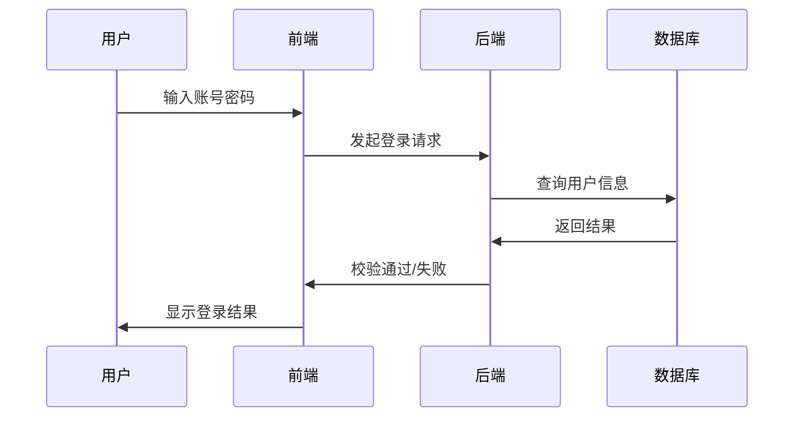

## MarkDown 绘制时序图

[TOC]


在Markdown中绘制时序图主要通过 **Mermaid** 语法实现，这是一种基于文本的图表生成工具，支持在多种编辑器（如Typora、VSCode等）中渲染。以下是具体实现方法及核心语法详解：

------

### 一、基础语法结构

1. 代码块声明

   时序图需包裹在 `mermaid` 代码块中，格式如下：

   ````
   ```mermaid
   sequenceDiagram
       // 参与者定义与消息交互
   ```
   ````

2. 参与者定义

   - **直接定义**：`participant A`（显示名称为A的参与者）。

   - **别名定义**：`participant l as 李雷`（用`l`代替“李雷”以简化代码）。

   - **角色类型**：可使用 `actor` 关键字定义角色（如用户、系统等）。

     

------


### 二、消息交互与箭头类型

消息通过箭头连接参与者，具体类型如下：

| 箭头符号 | 类型       | 含义                     | 示例               |
| :------- | :--------- | :----------------------- | :----------------- |
| `->>`    | 实线箭头   | 主动发出消息（如请求）   | `A->>B: 发送请求`  |
| `-->>`   | 虚线箭头   | 响应消息                 | `B-->>A: 返回结果` |
| `->`     | 实线无箭头 | 同步消息（不常用）       | `A->B: 同步调用`   |
| `--`     | 虚线无箭头 | 响应（不常用）           | `B-->A: 响应`      |
| `-x`     | 异步实线   | 异步消息（无需等待响应） | `A-x B: 异步请求`  |
| `--x`    | 异步虚线   | 异步响应                 | `B--x A: 异步响应` |


------


### 三、控制结构与高级功能

1. 循环（Loop）

   表示重复交互：

   ```
   loop 多次尝试
       A->>B: 重复请求
       B-->>A: 返回结果
   end
   ```

2. 条件分支（Alt/Opt）

   - **Alt**：多条件分支（类似if-else）：

     ```
     alt 条件A
         A->>B: 条件A成立
     else 条件B
         A->>B: 条件B成立
     end
     ```

   - **Opt**：可选分支（类似单条件if）：

     ```
     opt 条件
         A->>B: 条件成立时执行
     end
     ```

3. 并行（Par）

   多任务并行执行：

   ```
   par 任务1
       A->>B: 任务1执行
   and 任务2
       C->>D: 任务2执行
   end
   ```

   

------


### 四、注释与激活框

1. 注释（Note）

   - 左侧/右侧注释：`Note left of A: 注释内容` 或 `Note right of B: 注释内容`。
   - 跨参与者注释：`Note over A,B: 共享注释`。

2. 激活框（Activation）

   表示参与者处理消息的时间段：

   - 显式激活：

     ```
     activate A  // 开始激活
     A->>B: 处理中
     deactivate A  // 结束激活
     ```

   - 符号激活：通过  `+` 和 `-` 标记：

     ```
     A->>+B: 开始处理
     B-->>-A: 结束处理
     ```

     

------


### 五、环境配置与工具支持

1. **Typora**
   需在设置中启用Mermaid支持：`设置 -> Markdown -> 勾选“图表”`。

2. **VSCode**
   安装插件如 **Mermaid Markdown Syntax Highlighting**，直接在代码块中编写语法。

3. **在线工具**
   使用 [Mermaid Live Editor](https://mermaid.js.org/) 实时预览效果。

   

------


### 六、完整示例

以下是一个用户登录的时序图示例：



------

通过以上语法，可灵活绘制复杂的交互流程。如需进一步了解高级功能（如甘特图、类图），可参考 Mermaid 官方文档或相关教程。

